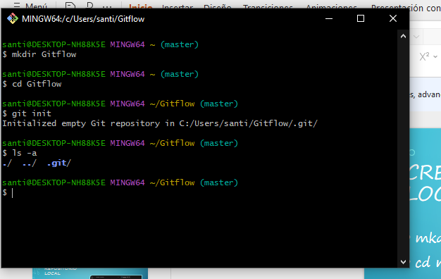
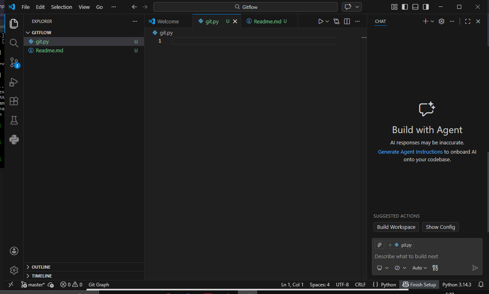
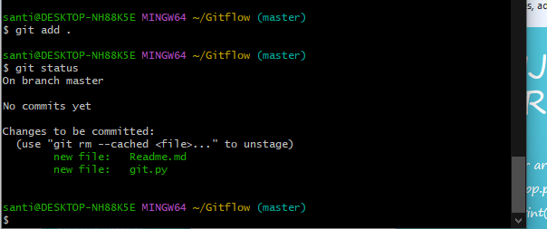
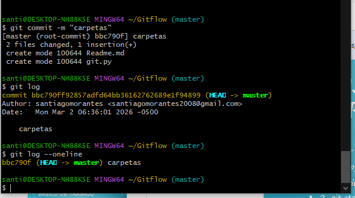
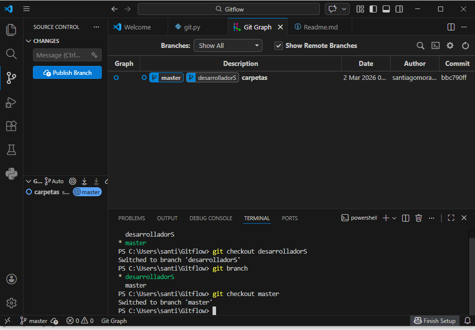
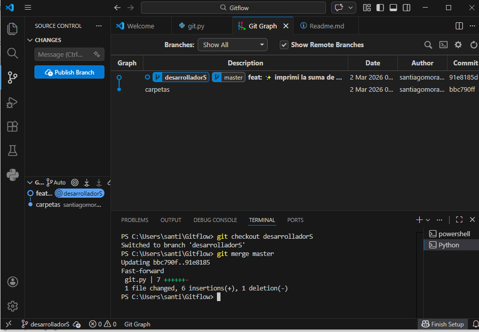
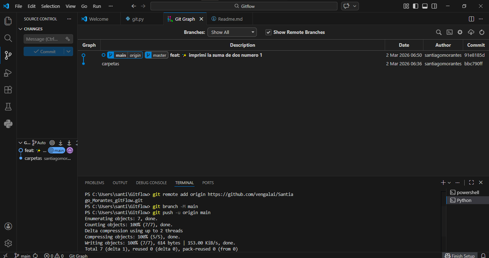
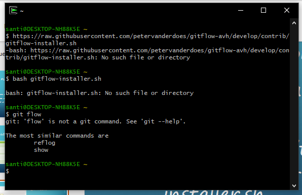
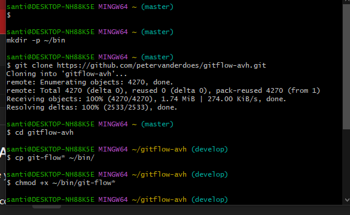
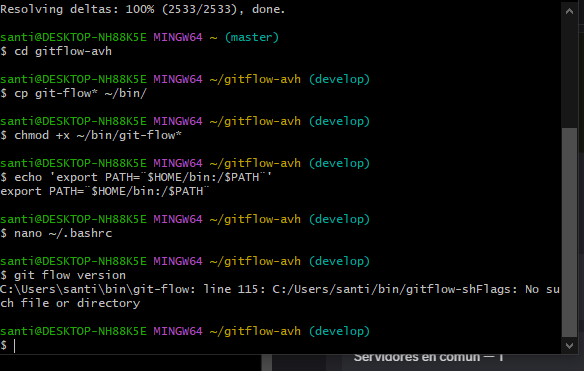

# Documentación

## Creación de la carpeta 

##  Creación de las carpetas .py y .md

## Utilización de comandos git add y git status

## Utilización de los comandos git commit y git log 

## Utilización de los comandos git branch y git checkout

## Utilización de git merge y creacion de un conventional commit

## Utilización de los comandos git remote add origin, git branch -M y git push -u origin

## Intento de instalacion de git flow 

